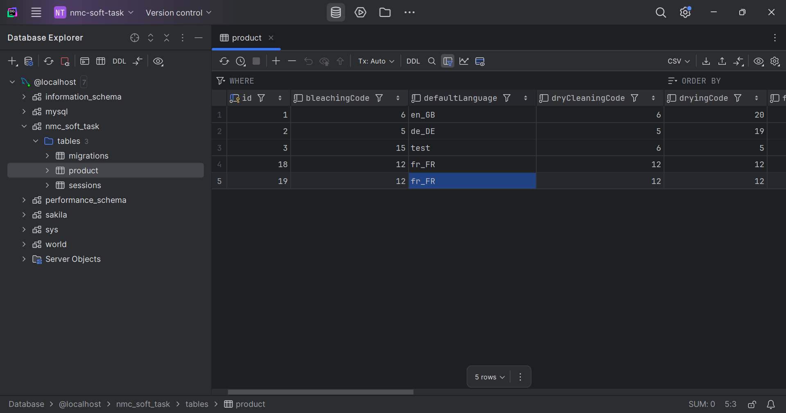
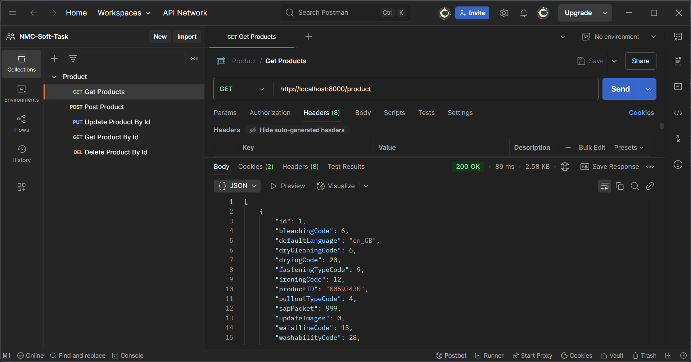
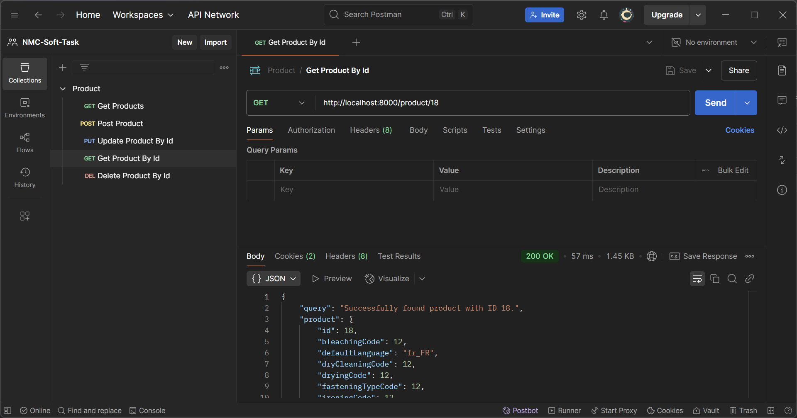
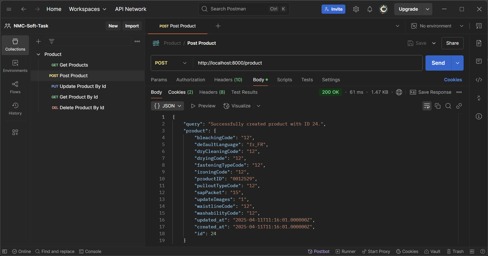
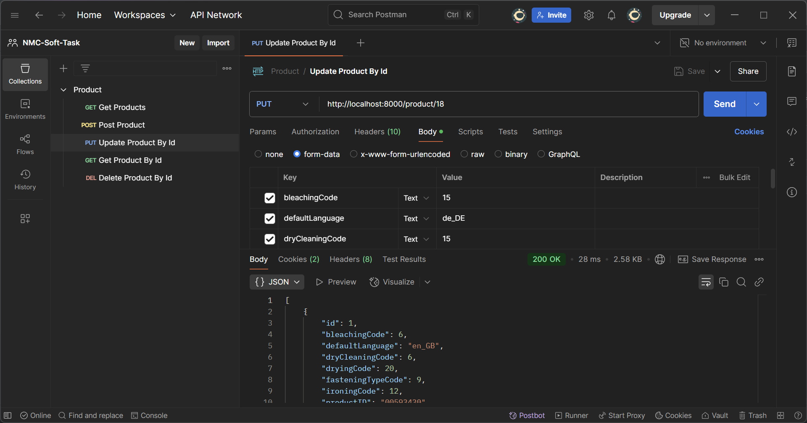
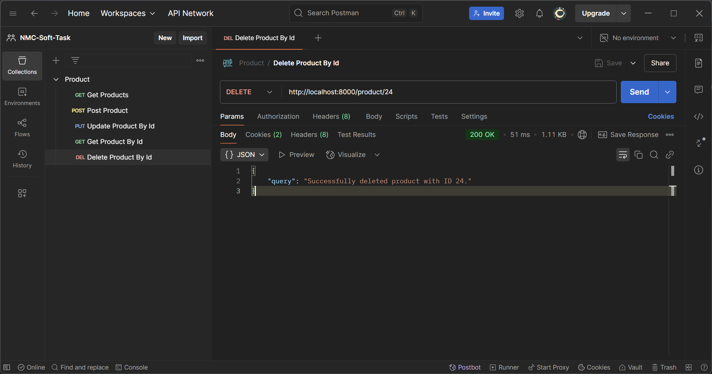

# Product CRUD App

#### A product management application API written in PHP with Laravel

### Application supports
 - *Create*, *Read*, *Update* and *Delete* (**CRUD**) functionality
 - HTTP requests for REST API with *Postman* are provided

## Worked on

 - **Migrations**: Create Product and Create Sessions
   - [database/migrations/2025_04_09_110404_create_product_table.php](database/migrations/2025_04_09_110404_create_product_table.php)
   - [database/migrations/2025_04_09_134256_create_sessions_table.php](database/migrations/2025_04_09_134256_create_sessions_table.php)

 - **Product Model**: Model schema for Product
   - [app/Models/Product.php](app/Models/Product.php)

 - **Product Controller**: Controller for CRUD methods on Product via REST
   - [app/Http/Controllers/ProductController.php](app/Http/Controllers/ProductController.php)

 - **Web Routes**: Routes for mapping CRUD methods on Product with URI
   - [routes/web.php](routes/web.php)

 - **App**: Middleware to exclude validation of CSRF Tokens on URI
   - [bootstrap/app.php](bootstrap/app.php)
 
 - **HTTP requests** to REST API with Postman
   - [ProductPostman.json](ProductPostman.json)

## Run project

Run project following the steps:
 - Configure Postman by importing HTTP requests from JSON: [ProductPostman.json](ProductPostman.json)
 - Run Laravel project server with: `php artisan serve`
 - Send HTTP requests to REST API with Postman to test CRUD functionality of Product Management application.

## Presentation

| Database                                                | Get Products                                                  | 
|---------------------------------------------------------|---------------------------------------------------------------|
|  |  |

| Get Product By Id                                                   | Post Product                                                  | 
|---------------------------------------------------------------------|---------------------------------------------------------------|
|  |  |

| Update Product By Id                                                | Delete Product By Id                                          | 
|---------------------------------------------------------------------|---------------------------------------------------------------|
|  |  |
